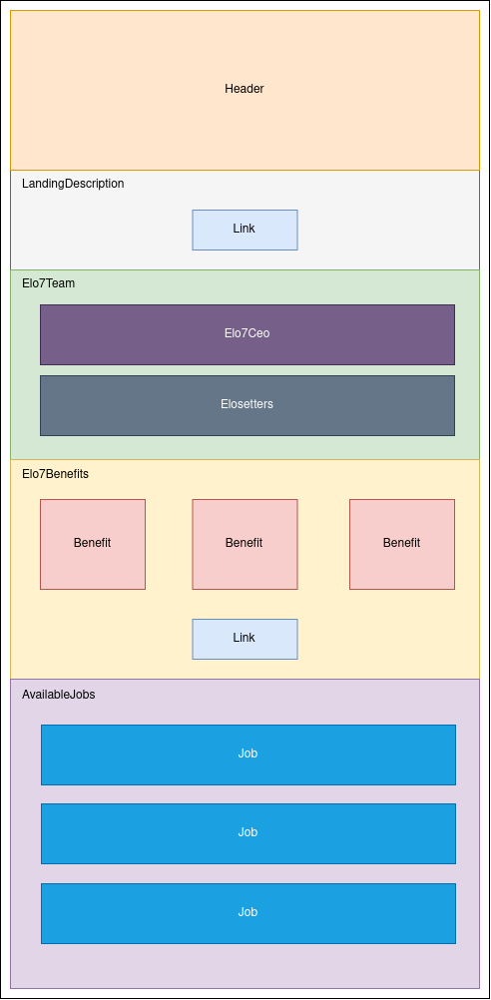

# Elo7 careers landing page

A Elo7 careers page created for the Front-End Software Engineer position at Elo7. The purpose of this project is to test web development skills in HTML5, CSS and Javascript. The challenge is at [this link](https://gist.github.com/elo7-developer/33a0844a9ac6953dd3e5).

## Technologies stack

This project uses HTML5, CSS, Javascript, React.js and Jest.

## How to execute

The application is deployed at https://elo7-careers.vercel.app/.

There are two ways to execute the application.

1) Using docker-compose:
```sh
docker-compose build # to build app image (only when running for the first time)
docker-compose run --rm web npm install # to install dependencies locally (only when running for the first time)
docker-compose up # to run app
```

2) Locally (node.js and npm need to be installed first):
```sh
npm install # to install dependencies (only when running for the first time)
npm start # to run app
```

To run the tests, you can use either of the options below:

1) Using docker-compose:
```sh
docker-compose run --rm web npm run test
```

2) Locally:
```sh
npm run test
```

## Components architecture

Based on the landing page, the page components were defined as follows:



## Folder structure

- `public/`: public files such as favicon.ico and index.html.
- `src/`:
  - `assets/`: it contains the images.
  - `components/`: it contains the components used in the app.
  - `pages/`: it contains the components that represent a page in the app (in our case, we have only one page).
  - `services/`: it contains the logic of the app, such as fetching and parsing available jobs that will be rendered.

Each component in the app has its own `index.jsx` and `styles.module.css` files. Some components also have a `hook.js` file, which is intended to separate the component's HTML structure from its logic.

## How the app can be improved

The list below includes some items that could be improved in the app.

- Optimize images loading
  - Using Lazy loading or SSR could be a solution
- CSS.
  - Create more CSS variables (for example margin/padding values)
  - Create common classes that contain styles used by almost all components (i.e. a class for a flex container).
- React
  - Create base, reusable components such as Container and Text so we can reuse some CSS styles.
- Generate a static website (to improve SEO performance).
